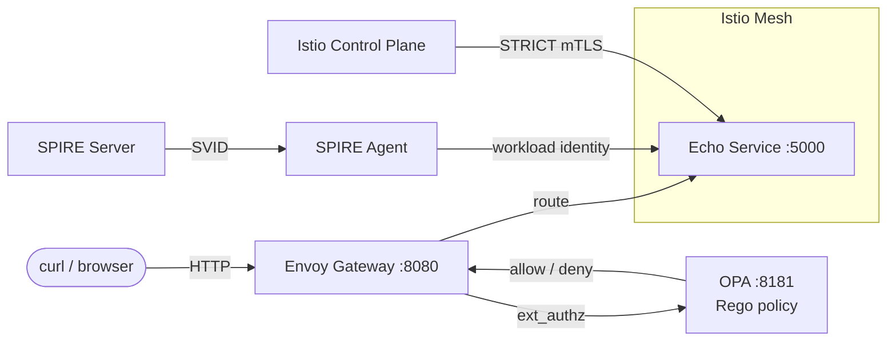

<h1 align="center">Zero Trust Bootup</h1>

<p align="center">
  <strong>SPIFFE/SPIRE identity + Istio mTLS + OPA policy + Envoy gateway — on a local Kubernetes cluster in under 5 minutes.</strong>
</p>

<p align="center">
  
  
  
  
  
  
</p>

<p align="center">
  <a href="#features">Features</a> •
  <a href="#architecture">Architecture</a> •
  <a href="#quick-start">Quick Start</a> •
  <a href="#live-demo-walk-through">Live Demo</a> •
  <a href="#repo-layout">Repo Layout</a> •
  <a href="#testing">Testing</a> •
  <a href="#references">References</a>
</p>

---

> **Conference talk:** This repository accompanies
> [**Zero Trust for APIs and Microservices: Service-Mesh Security in a Cloud-Native World**](https://www.youtube.com/watch?v=m4SDfJPQHQ8)
> and **Shift-Left Meets Zero Trust: Building Secure-by-Design APIs from Day Zero** (SEI 2025).
> Slides are included in the repo (`SEI-Secure-Software-by-Design-2025-Hariharan-Ragothaman.pptx`).

---

## Features

| Layer | Technology | What It Does |
|-------|-----------|--------------|
| **Identity** | SPIFFE / SPIRE | Issues short-lived X.509 SVIDs to every workload — no static secrets |
| **Transport** | Istio (STRICT mTLS) | Encrypts all pod-to-pod traffic; rejects plain-text connections |
| **Policy** | Open Policy Agent | Evaluates fine-grained Rego rules on every request (header, method, path) |
| **Gateway** | Envoy | Fronts the mesh with ext-authz filter wired to OPA |
| **Workload** | Echo Service (Flask) | Minimal microservice that echoes the caller's identity |

---

## Architecture



**Request flow:**

1. Client sends `curl -H "user: admin" http://localhost:8080/`
2. **Envoy** intercepts and calls OPA via the ext-authz filter
3. **OPA** evaluates the Rego policy — checks the `user` header
4. If allowed, Envoy routes to the **Echo Service** through the **Istio** mesh (mTLS encrypted)
5. **SPIRE** has already issued a SPIFFE ID (`spiffe://example.org/ns/default/sa/echo-service`) to the workload

---

## Quick Start

### Prerequisites

| Tool | Version | Install |
|------|---------|---------|
| Docker | 20+ | [docs.docker.com](https://docs.docker.com/get-docker/) |
| minikube _or_ kind | latest | [minikube.sigs.k8s.io](https://minikube.sigs.k8s.io/docs/start/) |
| kubectl | 1.25+ | [kubernetes.io](https://kubernetes.io/docs/tasks/tools/) |
| istioctl | 1.18+ | [istio.io](https://istio.io/latest/docs/setup/getting-started/) |

### One-Command Demo

```bash
git clone https://github.com/hariharanragothaman/zero-trust-bootup.git
cd zero-trust-bootup

minikube start --memory 4096 --cpus 4
./demo.sh
```

Within ~3 minutes you'll have:

* SPIRE server + agent issuing **SPIFFE IDs**
* Istio service-mesh enforcing **STRICT mTLS**
* Echo microservice with Istio sidecar
* Envoy gateway fronting the mesh
* OPA policy evaluating every request

### Try It

```bash
# Allowed — admin header present
curl -H "user: admin" http://localhost:8080/
# → Echo from admin

# Denied — non-admin user
curl -H "user: guest" http://localhost:8080/
# → 403 Forbidden
```

---

## Live Demo Walk-through

For a step-by-step version suited to live presentations, see
**[`docs/demo-guide.md`](docs/demo-guide.md)**.

The guide mirrors `demo.sh` but broken into individually executable steps with
explanations, making it easy to pause and discuss each zero-trust layer during
the talk.

---

## Repo Layout

```
zero-trust-bootup/
├── k8s/
│   ├── spire/                      # SPIRE server + agent manifests
│   │   ├── manifest.yaml           #   namespace, server config & deployment
│   │   ├── agent.yaml              #   agent DaemonSet with RBAC & tolerations
│   │   └── register-echo.yaml      #   workload registration Job
│   ├── istio/
│   │   └── peer-authentication.yaml  # STRICT mTLS PeerAuthentication
│   ├── app/
│   │   └── echo.yaml               # Echo service Deployment + Service
│   ├── opa/
│   │   └── opa.yaml                # OPA deployment + default-allow policy ConfigMap
│   └── gateway/
│       └── envoy.yaml              # Envoy proxy + ext_authz → OPA
├── policies/
│   └── opa/
│       ├── example.rego            # Restrictive Rego policy (admin-only)
│       └── example_test.rego       # OPA unit tests
├── src/
│   └── echo-service/
│       ├── app.py                  # Flask echo microservice
│       ├── requirements.txt        # Python dependencies
│       └── Dockerfile              # Container image
├── docs/
│   └── demo-guide.md              # Step-by-step live demo script
├── envoy.yaml                     # Standalone Envoy config (reference)
├── demo.sh                        # Automated one-shot demo script
├── .github/
│   └── workflows/
│       └── ci.yml                 # Lint + validate + test pipeline
├── LICENSE                        # MIT
└── README.md
```

---

## How the Demo Works

### Phase 1 — Default Allow (everything works)

The OPA ConfigMap in `k8s/opa/opa.yaml` ships with `default allow = true`, so all
requests pass through. This lets you demonstrate the happy path first.

### Phase 2 — Policy Enforcement (admin-only)

Swap to the restrictive policy from `policies/opa/example.rego`:

```bash
# Update the OPA ConfigMap with the real policy
kubectl create configmap opa-policy \
  --from-file=example.rego=policies/opa/example.rego \
  --dry-run=client -o yaml | kubectl apply -f -

# Restart OPA to pick up the new policy
kubectl rollout restart deploy/opa
```

Now only requests with `user: admin` are allowed — guests get `403 Forbidden`.

---

## Configuration Reference

### SPIRE

| Setting | Value | File |
|---------|-------|------|
| Trust domain | `example.org` | `k8s/spire/manifest.yaml` |
| Workload SPIFFE ID | `spiffe://example.org/ns/default/sa/echo-service` | `k8s/spire/register-echo.yaml` |
| Node attestor | `k8s_psat` | `k8s/spire/manifest.yaml` |
| Data store | SQLite3 | `k8s/spire/manifest.yaml` |

### Istio

| Setting | Value | File |
|---------|-------|------|
| mTLS mode | `STRICT` | `k8s/istio/peer-authentication.yaml` |

### OPA / Rego

| Setting | Value | File |
|---------|-------|------|
| Default policy | `allow = true` (demo start) | `k8s/opa/opa.yaml` |
| Restrictive policy | admin-only GET | `policies/opa/example.rego` |

### Envoy Gateway

| Setting | Value | File |
|---------|-------|------|
| Listen port | `8080` | `k8s/gateway/envoy.yaml` |
| Auth backend | `http://opa:8181` | `k8s/gateway/envoy.yaml` |
| Auth path | `/v1/data/httpapi/authz` | `k8s/gateway/envoy.yaml` |

---

## Testing

### OPA Policy Tests

```bash
# Requires: brew install opa (or download from openpolicyagent.org)
opa test policies/opa/ -v
```

### CI Pipeline

The GitHub Actions workflow (`.github/workflows/ci.yml`) runs on every push and PR:

| Check | Tool | What It Validates |
|-------|------|-------------------|
| YAML lint | yamllint | All YAML files are well-formed |
| K8s manifests | kubeconform | Kubernetes resources match API schemas |
| OPA policy | opa test | Rego policy unit tests pass |
| Shell lint | shellcheck | `demo.sh` follows best practices |

---

## Troubleshooting

| Symptom | Likely Cause | Fix |
|---------|-------------|-----|
| `istioctl: command not found` | Istio CLI not installed | `curl -L https://istio.io/downloadIstio \| sh -` |
| SPIRE server never becomes ready | Insufficient cluster resources | Increase minikube memory: `--memory 6144` |
| OPA returns 403 for everything | Restrictive policy loaded | Check ConfigMap: `kubectl get cm opa-policy -o yaml` |
| mTLS not enforced | Sidecar not injected | Verify label: `kubectl get ns default --show-labels` |
| Port-forward dies immediately | Service not yet ready | Wait and retry: `kubectl wait --for=condition=available deploy/echo-service` |

---

## References

* [SPIFFE / SPIRE](https://spiffe.io) — Secure Production Identity Framework for Everyone
* [Istio Security](https://istio.io/latest/docs/concepts/security/) — mTLS, authorization policies
* [Open Policy Agent](https://www.openpolicyagent.org/) — Policy as code
* [Envoy ext_authz](https://www.envoyproxy.io/docs/envoy/latest/configuration/http/http_filters/ext_authz_filter) — External authorization filter
* [NIST SP 800-207](https://csrc.nist.gov/publications/detail/sp/800-207/final) — Zero Trust Architecture

---

## License

[MIT](./LICENSE) — Hariharan Ragothaman
